=========================
Introduction to RDFBones
=========================

The RDFBones standard consists of a hierarchy of ontologies which describe specific processes employed in osteology and their output datasets. Datasets produced with RDFBones ontologies can be queried with the query language *SPARQL*. Queries are the main method by which data is produced in the RDFBones software implementation **AnthroGraph** and they are also the main method for extracting data, be it only select elements of a dataset or the entire dataset itself, from AnthroGraph's database. In order to write SPARQL queries for these datasets, it is necessary to understand how the datasets work. This guide provides a basic introduction to pivotal concepts of SPARQL and **RDF**, the data model on which the RDFBones standard is based, and of which SPARQL is the recommended query language. This guide further provides directions on how the RDFBones documentation can be used to assist in writing a SPARQL query for a given RDFBones dataset.

-----------------------------------
Basic concepts of RDF and RDFBones
-----------------------------------

++++++++++++++++++++
Triples and classes
++++++++++++++++++++

RDF data consists of triples. A triple consists of 3 elements which are read in a set direction and offer some kind of meaning. Such data is referred to as semantic data. The 3 elements of an RDF triple are commonly referred to as **subject**, **predicate**, and **object**. Typically, any subject can also be an object and vice-versa. Whether a data item becomes a subject or object is dependent upon what information is being conveyed by the triple it is part of.

In the above image, a given inventory has a part that is a section. The opposite is not true; an inventory cannot be part of its own sections. However, an inventory section can have a predicate which signifies that it is a part of something (the inverse of the 'has part' preicate), or that it is a subclass of another class:

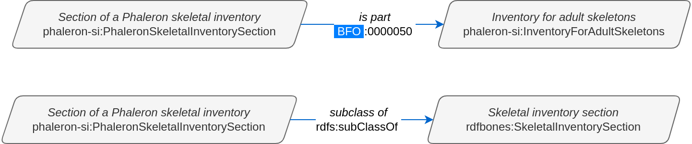

Note that the inventory section is now the subject in these two examples, not the object.

..................................
Predicates as specialized classes
..................................

As a side note, it can be helpful to appreciate classes that are used as predicates as distinct in function from the classes that are encountered as subjects and objects. You can imagine subjects and objects as "things that are" in a dataset and predicates as linking elements that describe the relations between these "things that are". Case in point, predicates used in RDFBones generally do not appear as subjects or objects in triples.

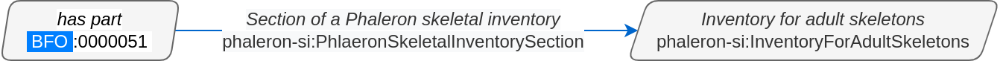

The above triple states: the class 'has part' has the class 'Inventory for adult skeletons' as the class 'Section of a Phaleron skeletal inventory'. It is theoretically possible to create this specific triple and save it in an RDF dataset, but naturally, this triple does not make any kind of sense, and there is no RDFBones implementation that produces it or could make use of it.

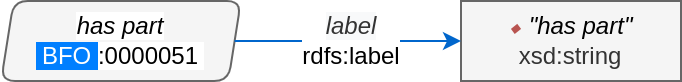

In contrast, the above triple does exist, despite the class 'has part', which is typically used only as a predicate in RDFBones datasets, being placed as the subject. This is because this triple provides information on the class 'has part' itself, namely what the label of the class is (namely "has part"). However, this information is restricted to the definition of the 'has part' class in the ontology; when looking at triples that were produced when an RDFBones-related dataset is created, you are unlikely to ever find a class that is used as predicate throughout the dataset as the subject or object of any of the triples in the dataset. Unlike subject/object classes, predicate classes are also never instantiated in RDFBones datasets.

Reflecting this distinction between subject/object and predicate, predicate classes are frequently referred to as "annotation properties", "object properties", and "data properties", depending on what kind of relation between a subject and an object the predicate describes. This is mainly a cosmetic distinction made to recognize the way these classes are used; predicates can still be used as subjects and objects when necessary, they still have an IRI, and they can be queried same as any other class.

.. _IRISection:
++++++
IRIs
++++++

Subjects, predicates, and objects all have identifiers. Such an identifier is called an Internationalized Resource Identifier (IRI). IRIs are essentially just a unique string of text, and they look similar to (and in some ways function like) the URLs we know from browsing the web. The IRI of a class can be looked up in the ontology in which the class is defined. The following image shows the 'Inventory for adult skeletons' class being inspected in the ontology editing software Protégé:

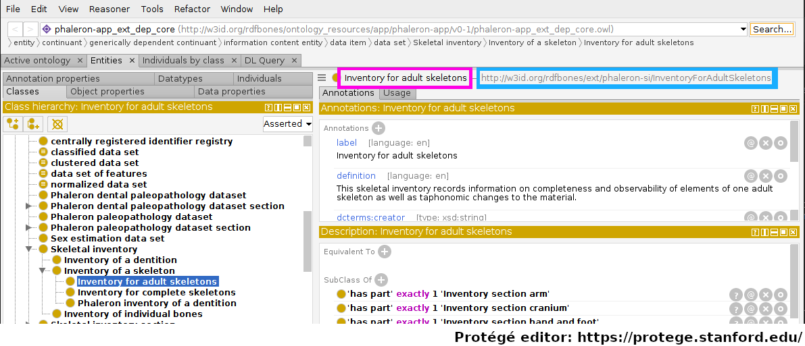

Protégé displays a lot of information; for the moment, let us focus only on the fact that the class 'Inventory for adult skeletons' has been selected and look to the top right of the interface. Highlighted in magenta is the label of the class, which Protégé, like many other applications that work with semantic data, automatically pulls from the 'rdfs:label' triple of the class currently being inspected. The actual IRI is highlighted in cyan.

Within a single ontology, each IRI must be unqiue; the label however does not need to be unique. This is an imprtant distinction: imagine an ontology defining both gender and biological sex - you may want both gender and sex to have the label "male", but you will also want the two distinct concepts to be represented by two distinct classes, where each has a specific definition. Instances of classes may also cause confusion when it comes to IRIs, see :ref:`ClassesInstancesSection` for more details on instances and their IRIs.

In effect, ontologies are where the exact string of the IRIs of classes are "decided on". The string can be more or less made up arbitrarily by the auther of the class, though generally the prefix of the IRI will be the same within an ontology. For example, in the Phaleron skeletal inventory extension ontology, we find the classes: ::

	http://w3id.org/rdfbones/ext/phaleron-si/InventoryForAdultSkeletons
	http://w3id.org/rdfbones/ext/phaleron-si/PhaleronSkeletalInventorySection

These share the prefix "http://w3id.org/rdfbones/ext/phaleron-si/". In the Walker's sex estimation ontology, we find the classes have a different prefix: ::

	http://w3id.org/rdfbones/ext/walker-se/GlabellaMorphology
	http://w3id.org/rdfbones/ext/walker-se/MentumMorphology

This first part of the IRI is what is adressed by the "PREFIX" element found in SPARQL queries, see :ref:`PrefixesSection` for details.

.. _ClassesInstancesSection:
+++++++++++++++++++++++++++++++++
Classes and instances of classes
+++++++++++++++++++++++++++++++++

Classes generally describe concepts in the abstract, that is, they do not describe a "real-world" instance of something. For example, there may be a specific skeletal inventory saved in a database somewhere. A class on skeletal inventories would describe only what any potential skeletal inventory of that type would be like, which would include this specific instance of skeletal inventory saved on the database. The class describes the idea, and instances of a class are examples of this idea "made real".

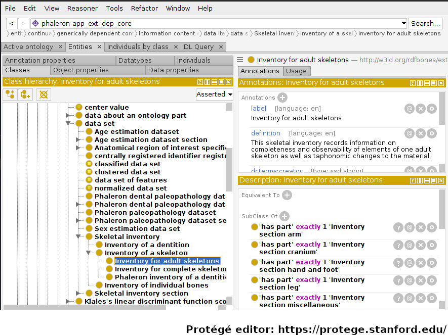

In the image above, an RDFBones ontology file has been opened in the ontology editing software 'Protégé'. In this screenshot, Protégé can be divided into 3 sections: the class hierarchy section, which lists all classes in the ontology and shows the parent-class/subclass/sibling-class relations of these classes. The class 'Inventory for adult skeletons' has been selected and is highlighted blue. In the top-right, the annotations of the selected class are shown. Annotations give information on a class, which usually entails aspects such as a label, the name of the author of the class, and a definition on what the class represents. In the bottom-right, under the head "Descriptions", axioms and restrictions of the class are shown. These elements give information on how to use the class in a dataset; where the annotations give information in text form that must generally be interpreted by humans, the axioms and restrictions can be interpreted as logical operations by machines as well.

Classes can be instantiated, which means the abstract concept is applied to a concrete occurence. This can apply to entities such as human skeleton that was excavated, a measurement made on a bone of that skeleton, or a dataset in which the measurement is saved. Instances can also include processes, such as the porcess of a measurement being performed or a skeletal inventory being inventoried.

As a simple example, let us take an instance of the class 'Inventory for adult skeletons':

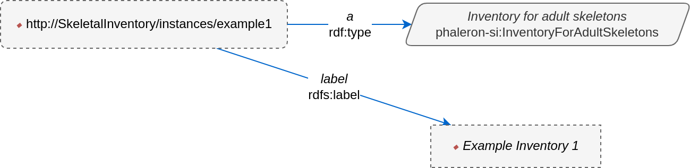

In this imaginary example, the instance of the class has an IRI that is distinct from the class it instantiates. This is a must: an instance may not have the same IRI as a class, as this would mean instance and concept are the same. This example instance has further received a label in order to make it more easily identifiable. Labels, unlike IRIs, are optional for an instance (the same applies to classes), and if an instance does not have a label, applications may try to "improvise" one by looking at the IRI or the class it is instantiating. Some applications, such as AnthroGraph's skeletal inventory, will hence force the user to supply a label for important instances in order to prevent such confusion.

In a more complex illustration of instantiation, consider the network graph describing how observer and data editor roles are recorded in Phaleron inventories in RDFBones. First, the uninstantiated graph:

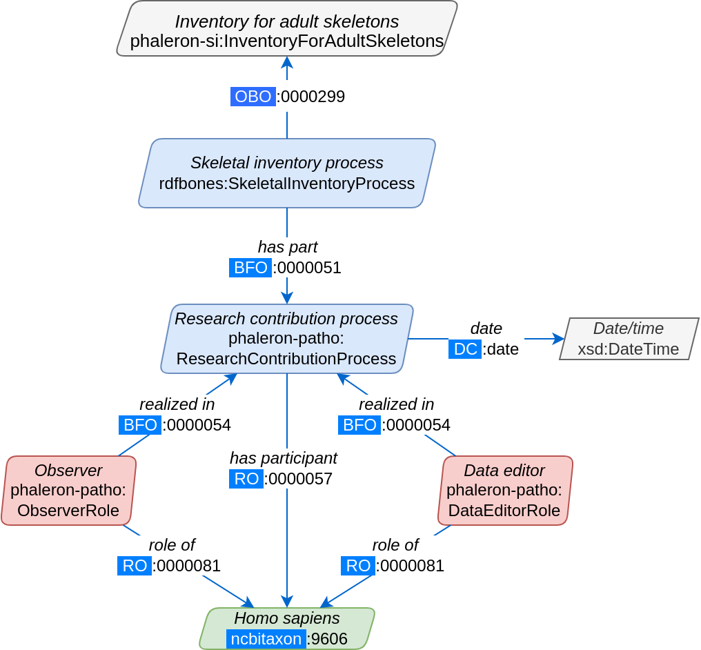
   
Red coloured classes refer to the scientific role a researcher or data editor has assumed, while blue classes refer to (scientific) processes, i.e. the skeletal inventory dataset is the product of the inventorying process (See :ref:`LegendExplainSection` for further details on how to read RDFBones network graphs). Now, we produce an example dataset according to the uninstantiated blueprint provided by the above graph:

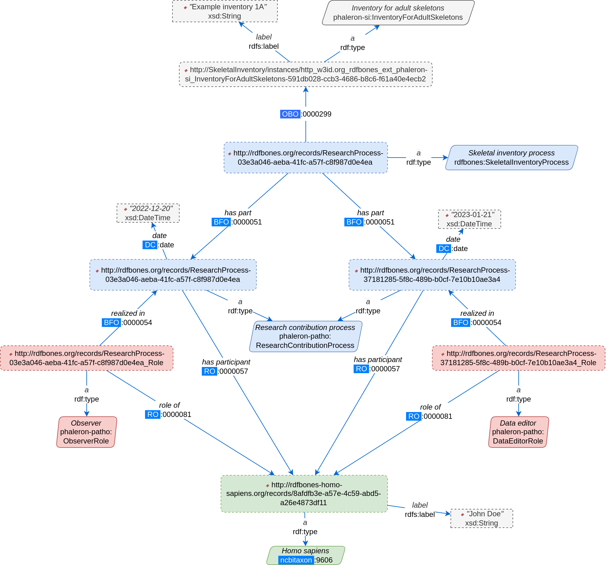

This graph appears more complex since it has an additional element over the uninstantiated graph: every class (solid-outlined parallelogram) has been replaced by an instance (dotted-outlined rectangles), and each instance has an 'rdf:type' triple specifying what the instance is. Furthermore, the IRI of the class is replaced by the IRI of the instance; some instances have received labels (e.g. the inventory), while others have not (e.g. the research contribution processes). Whether or not an instance has a label has no relevance on the validity of the instance; the label is only for easier differentiation and is added when deemed necessary, such as when naming a skeletal inventory. The IRI of every instance is unique and suffices to differentiate instances of the same class, though it is generally more difficult for human eyes than having unique labels.

Note that instead of the term "instance", you may also encounter the terms "individual" or "named individual". For our purposes, these 3 terms can be considered synonymous.

.....................
SPARQL query example
.....................

Let's say we want to know which skeleton was the first one that was observed. We know that every observer of a skeleton is saved in our database, along with the date at which the skeleton was observed. The following query finds the date of all observer events of adult skeletal inventories in our database, orders them from oldest to most recent, then limits the number of shown results to one so that only the oldest result remains: ::

	PREFIX rdfs: <http://www.w3.org/2000/01/rdf-schema#>
	PREFIX rdf: <http://www.w3.org/1999/02/22-rdf-syntax-ns#>
	PREFIX obo: <http://purl.obolibrary.org/obo/>
	PREFIX dc: <http://purl.org/dc/terms/>
	PREFIX phaleron-si: <http://w3id.org/rdfbones/ext/phaleron-si/>
	PREFIX phaleron-patho: <http://w3id.org/rdfbones/ext/phaleron-patho/>

	SELECT ?Inventory ?Date ?Person
	WHERE {
	?Inventory a phaleron-si:InventoryForAdultSkeletons .
	?InventoryProcess obo:OBI_0000299 ?Inventory ;
    	obo:BFO_0000051 ?ResearchProcess .
	?ResearchProcess a phaleron-patho:ResearchContributionProcess ;
    	dc:date ?Date .
	?Observer obo:BFO_0000054 ?ResearchProcess .
	?Observer a phaleron-patho:ObserverRole ;
            obo:RO_0000081 ?Person .
	}
		ORDER BY ASC(?Date)
		LIMIT 1

If you run this query, you will likely get results that appear to be mostly just random strings. This is because we are querying the IRIs of our inventory instance and our "observing person", which is also an instance. In AnthroGraph, you can click on the "fetch labels" button to rectify this. Alternatively, we can just query the labels ourselves: ::

	PREFIX rdfs: <http://www.w3.org/2000/01/rdf-schema#>
	PREFIX rdf: <http://www.w3.org/1999/02/22-rdf-syntax-ns#>
	PREFIX obo: <http://purl.obolibrary.org/obo/>
	PREFIX dc: <http://purl.org/dc/terms/>
	PREFIX phaleron-si: <http://w3id.org/rdfbones/ext/phaleron-si/>
	PREFIX phaleron-patho: <http://w3id.org/rdfbones/ext/phaleron-patho/>

	SELECT ?InventoryLabel ?Date ?PersonLabel
	WHERE {
	?Inventory a phaleron-si:InventoryForAdultSkeletons ;
		rdfs:label ?InventoryLabel .
	?InventoryProcess obo:OBI_0000299 ?Inventory ;
    	obo:BFO_0000051 ?ResearchProcess .
	?ResearchProcess a phaleron-patho:ResearchContributionProcess ;
    	dc:date ?Date .
	?Observer obo:BFO_0000054 ?ResearchProcess .
	?Observer a phaleron-patho:ObserverRole ;
            obo:RO_0000081 ?Person .
    ?Person rdfs:label ?PersonLabel .
	}
		ORDER BY ASC(?Date)
		LIMIT 1

Note that we had to change the values in the SELECT part of the query to fit the values of the labels. You can search the most recent event by switching 'ORDER BY ASC' into 'ORDER BY DESC'. 

+++++++++++
Ontologies
+++++++++++

Ontologies contain information on classes and other concepts relevant for describing data, such as instances of classes and logical axioms. The ontologies come in the form of text files with a specific type of formatting which makes them machine-readable. Every class in an ontology *must* have an IRI, and a class will usually have further information such as a definition and instructions on how it is to be used in datasets.

................................................
RDFBones core ontology and extension ontologies
................................................

The RDFBones standard is defined through a collection of ontologies, wherein the **RDFBones core ontology** forms the basis of the standard. The core ontology contains primarily those concepts which are likely to be used in many, if not all, RDFBones extension ontologies. Extension ontologies describe more specific osteological investigations and their output data, e.g. a specific method for estimating the age of an individual. The information found in this document offers further guidelines on how concepts defined in the ontology came to be and how they are intended to be used.
Integral to understanding ontologies and ontology datasets, especially when attempting to navigate the datasets via SPARQL, are the network graphs produced by the authors of the extension.

.. _RDFBonesNetworkGraphsSection:
-------------------------
RDFBones network graphs
-------------------------

Network graphs describe the information of a semantic data in a visual form, rather than the text-based form RDF data usually employs. RDFBones network graphs are saved in a specific file format, namely *Scalable Vector Graphics* (SVG). RDFBones' svg files should only be opened with programs that allow for the use of tabs in svg files. This is currently *not* the case with most web browsers and many pre-installed iamge viewing applications. We recommend using the free, open source browser application `app.diagrams.net <https://app.diagrams.net/>`_, also known as draw.io, and which can also be `installed locally as an app <https://www.drawio.com/>`_.

+++++++++++++++++++++++++++++++++++++++
Where to find specific network graphs
+++++++++++++++++++++++++++++++++++++++

All network graphs related to RDFBones can be found in the `Git repository for RDFBones graphics <https://github.com/RDFBones/RDFBonesGraphics/tree/main/NetworkGraphics/>`_. General concepts at the core of osteology or concepts re-used throughout multiple RDFBones implementations can be found in the "CoreOntology" folder, which naturally refers to and contains all data defined by the RDFBones core ontology.

Specific methods and investigations are implemented as extension ontologies. Their network graphs are thus found in the "OntologyExtensions" folder. Each extension has its own graph, wherein all the infromation is provided on how the extension models its output data. In the next section of this document, simplified versions of some of these graphs are provided to serve as an introduction on how to navigate these graphs and find the information necessary to e.g. write a SPARQL query for data extraction.

Explantory network graphs can be found in the repository mentioned above for the following extension ontologies:

* phaleron-si: skeletal inventories according to specifications of the Phaleron Bioarchaeological Project
* phaleron-patho: skeletal pathologies according to specifications of the Phaleron Bioarchaeological Project
* phaleron-di: dental inventories according to specifications of the Phaleron Bioarchaeological Project
* phaleron-dpatho: dental pathologies according to specifications of the Phaleron Bioarchaeological Project
* phaleron-sexest: sex estimation according to specifications of the Phaleron Bioarchaeological Project

See also the sections :ref:`IRISection` and :ref:`PrefixesSection` on how to read and adress the IRIs shown in the network graphs.

++++++++++++++++++++++++++++++++++++++++++++
Understanding and navigating network graphs
++++++++++++++++++++++++++++++++++++++++++++

The graphics describing the RDFBones standard's data model can seem overwhelming at first glance. This section introduces you to the elements that are most important when viewing these network graphs.

.............................................................
Measurement data
.............................................................

Measurement data are classes used when recording data on osteological observations in RDFBones, such as the presence of a region of interest or the status of a pathology. They are thus a highly central element in most RDFBones datasets and their according network graphs. Measurement data are conspicuous in that they repeat the same structure even every extension and implementation they are used: each instance of a measurement datum is connected to a value specification instance. Each of these value specification instances then is connected to an element which provides the information on the observation, such as a category label or a numeric value. Often the measurement datum also is about a certain region of interest, though some measurement datum types only have a single instance in a dataset, in which case they do not require a region of interest to be specified within the dataset itself.

By combining the type of the measurement datum - denoted via the predicate of 'rdf:type' - and its region of interest - denoted via the predicate of 'is about' (IRI: http://purl.obolibrary.org/obo/IAO_0000136) - each measurement datum can be identified in a dataset. Once this concept is understood, the apparent complexity of most network graphs is reduced considerably.

.........................................................
Translating network graphs into datasets and vice-versa
.........................................................

This section gives a to-the-point explanation on how to get from the top dataset instance to a given measurement datum in an RDFBones ontology, which is a common requirement for SPARQL queries extracting data for research purposes. The network graphs in this section only contain a fraction of the full information found in the RDFBones standard. For the full graphs, see the above section :ref:`RDFBonesNetworkGraphsSection`.

.. _LegendExplainSection:
~~~~~~~~~~~~~~~~~~~~~~~~~
Understanding the legend
~~~~~~~~~~~~~~~~~~~~~~~~~

First, let us look at the full legend for RDFBones network graphs:

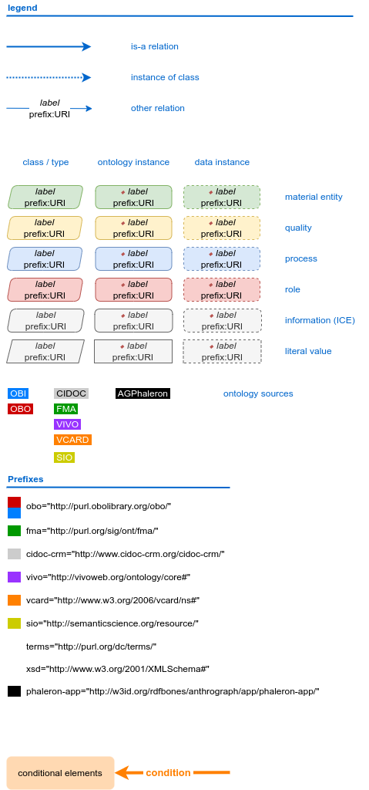

In many cases, only a small part of this legend will be relevant for a SPARQL query. Let us focus on those elements:

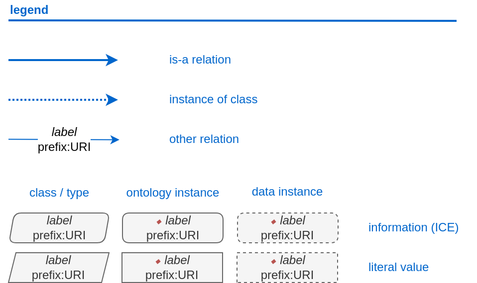
   
The legend tells us the following:

* The 'is-a' relation is equivalent to the predicate 'rdfs:subClassOf', i.e. it tells us that the class the arrow points from is a child class of the class the arrow points towards. The 'is-a'-arrow is slightly thicker than the other arrows.
* The 'instance of class' relation is equivalent to the predicate 'rdf:type'. It means the class at the base of the arrow is an instance of the class the arrow is pointing towards. The arrow can be identified by its dotted line. The 'rdf:type' predicate is frequently represented by the label 'a' in documentation, queries, and some network graphs. In fact, when writing a query in most SPARQL processing software it is possible to replace 'rdf:type' with 'a'. The 'rdf:type' relation is highly useful for telling SPARQL what you are looking for and is thus very frequently used in most queries. Be sure not to confuse the predicate 'a' with the 'is-a' predicate mentioned above.
* 'other relation' means the label written on the arrow tells us what the predicate is. The arrow accordingly represents that predicate.

The 'label' in the legend for the 'other relation' arrow is a placeholder for the actual predicate's  label. If the actual predicate is in fact 'rdfs:label', then the arrow will still show 'label' with 'prefix:URI' being turned into 'rdfs:label', since 'label' is the label of the class 'label, with its IRI being <http://www.w3.org/2000/01/rdf-schema#label>. The IRI shown in RDFBones network graphs assumes a prefix has been defined in the SPARQL query, see :ref:`IRISection` and :ref:`PrefixesSection` for details.

Always pay close attention to the direction the arrow of a predicate is pointing in network graphs, as reversing the triple's reading direction is an easy way to accidentally make a SPARQL query give incorrect outputs. In the following example:

   
The triple is written 'phaleron-si:InventoryForAdultSkeletons' 'obo:BFO_0000051' 'phaleron-si:PhaleronSkeletalInventorySection'. The arrow always points from subject to object.

~~~~~~~~~~~~~~~~~~~~~~~~~~~~~~~~~~~~~~
Ontology instances and data instances
~~~~~~~~~~~~~~~~~~~~~~~~~~~~~~~~~~~~~~

Finally, notice that some of the boxes in the full legend and the network graphs have different shapes and colours. These also contain specific meaning. In the abbreviated legend, we again have the 3 columns:

* **Class** (or type) elements are parallelograms. They are what we commonly refer to simply as "classes". Both data instances and ontology instances have 'rdf:type' relations to a **class**
* **Data instances** are instances of a class in a dataset, i.e. they are the reification of the concept of the class, see the section :ref:`ClassesInstancesSection`. You can also imagine them as "dataset instances", as opposed to the "ontology instances"
* **Ontology instances** are instances that are not defined by the context of the dataset in which they were generated, but are instead "pre-generated instances" defined within an ontology file

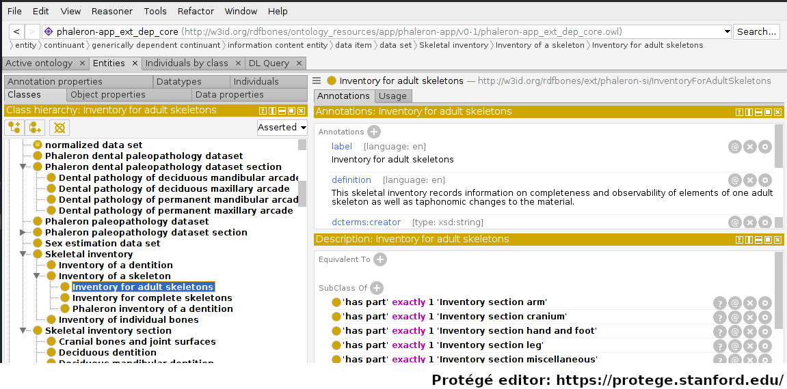
   
Classes are defined in ontologies, such as the RDFBones ontology above that has been openend in the ontology editiong software 'Protégé'.

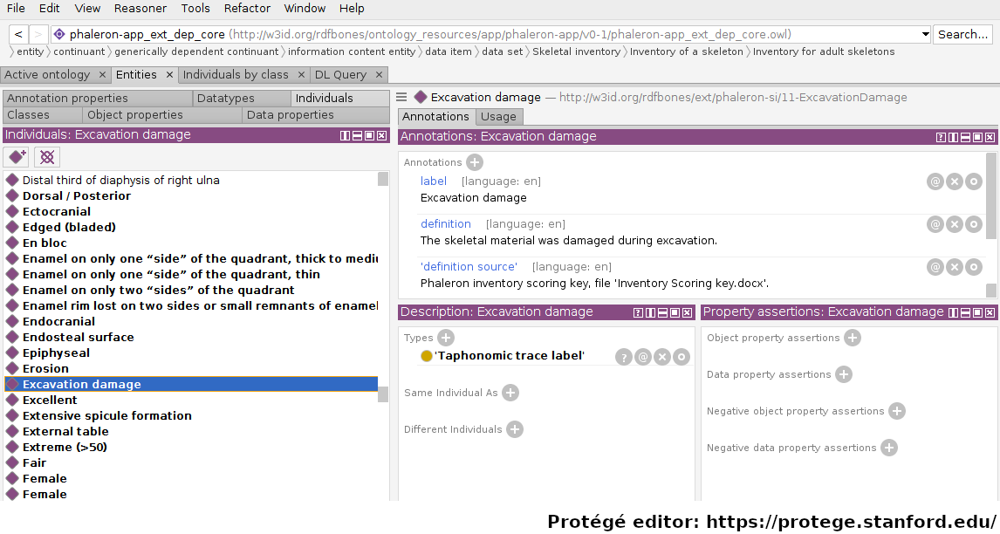

Ontology instances are also defined in an ontology. Like instances in datasets, they relate to a class via the predicate 'rdf:type'. In the above image, the ontology instance 'Excavation damage' has been highlighted. It is an instance of the class 'Taphonomic trace label'.

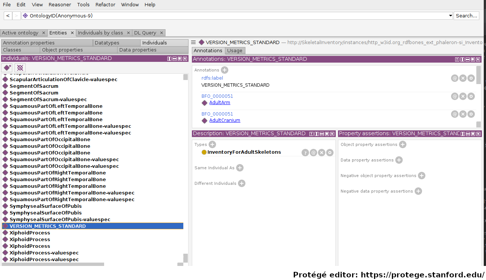

The above image shows an RDFBones dataset that has been opened in Protégé. RDF and RDFBones datasets are not ontologies, but they can function like one in many ways. In this case, a skeletal inventory dataset has been opened, and the instance of the 'Inventory for adult skeletons' class has been highlighted. Since this is a skeletal inventory dataset, there is only a single such instance, and it has the name of the inventory - "VERSION_METRICS_STANDARD" - as its label. In fact, this is where the label of an inventory is saved and where AnthroGraph looks when it wants to show the inventory's name in the user interface.

Like the ontology instance, this data instance has an rdf:type relation. The difference between an ontology instance and a data instances is subtle, but it is relevant for writing queries. In the RDFBones standard, certain qualities or attributes may be "of the type" of certain classes; in the sense that they have the predicate 'rdf:type', but also in the sense that they are of a certain type of attribute. For example, 'Male' can be "of the type" 'human sex category', where 'human sex category' is a class, and 'Male' is an instance of that class. 'Female' and 'Intersex' may be further instances of 'human sex category'. However, the attribute of 'Male', 'Female', and 'Intersex' can all be "re-used" and assigned to any number of instances of e.g. human skeletons that have been sexed, despite being an instance themselves. These ontology-defined instances will always have the same IRIs each time they appear; data instances in turn will have a different IRI for each unique dataset. 'Excavation damage' is one such example: any number of measurement data that observe the taphonomy of a bone may be "of the type" 'Excavation damage', where they all refer to the same type of taphonomic change (i.e. excavation damages). The data instance of our skeletal inventory on the other hand does not get re-used in such a way. There is only one such inventory, and its IRI is different from all other adult skeleton inventories.

Finally, 'Information content entities' (ICE) are exactly what the name implies: items that represent data. This class purposefully encapsulates a very broad range of data. In contrast, literal values refers only to strings of text like comments or a numeric value for the number of unidentified fragments of a bone, etc. ICEs stand in contrast to processes, where some action is performed over a certain amount of time such as a measurement being taken or a conclusion being drawn, and material entities, where a physical object such as a bone or a human being is being represented by a data point.

~~~~~~~~~~~~~~~~~~~~~~~~~~~~~~~~~~~~~~~~~~~~~
Finding a datum in an example network graph
~~~~~~~~~~~~~~~~~~~~~~~~~~~~~~~~~~~~~~~~~~~~~

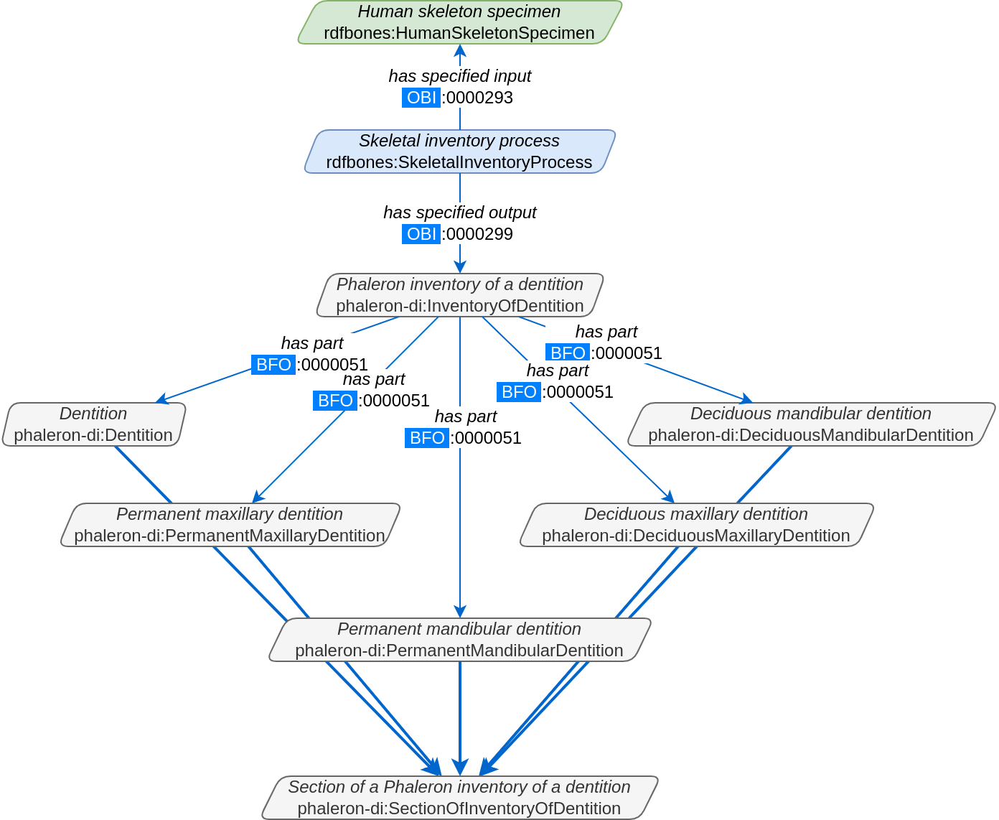

The above figure shows a simplified version of the Phaleron dental inventory network graph. It shows what can be considered the starting point of the graph, namely the dental inventory dataset instance, which has been produced by an inventorying process that used a human skeleton as an input. Attached to the dataset instance are the 5 different sections of the dental inventory. The predicate used is 'has part' (IRI: http://purl.obolibrary.org/obo/BFO_0000051).

In this example, we want to find a specific measurement datum, namely the presence of the right third upper molar tooth socket. We know that this would be in the permanent maxilla, so if we were looking at the full network graph, we would now switch to that tab.

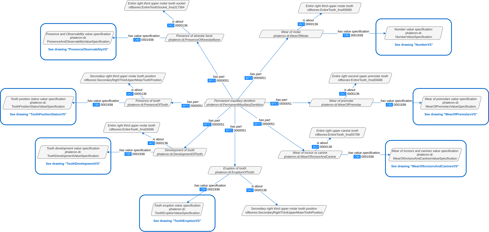

This is a simplified version of the permanent maxilla tab. Even still, it appears complex. However, we only need to focus on the section that concerns the alveolar bone, where we will find our socket measurement datum:

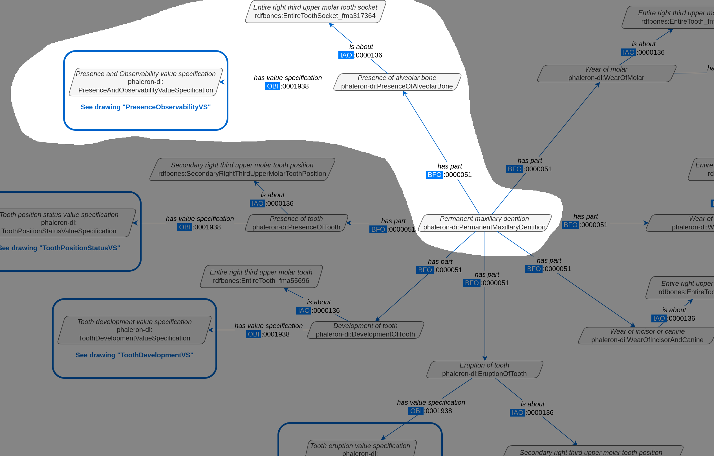
   
The blue box around the value specification tells us that we need to switch tabs again to get details on the value specification. This is the method by which network graphs are navigated: we start with the first tab, where we find the dataset instance, and follow the data model towards the data item we want. The next section gives assistance on how to make sense of what you find in the actual dataset, and how this translates to the more abstract "theoretical" data model provided in the network graphs.

~~~~~~~~~~~~~~~~~~~~~~~~~~~~~~~~~~~~~~~~~~~
Translating from dataset to network graph
~~~~~~~~~~~~~~~~~~~~~~~~~~~~~~~~~~~~~~~~~~~

Strictly speaking, the network graphs show you exactly what the actual datasets in AnthroGraph contain. However, mentally translating the abstract class concept of the network graph into the instantiated version of a dataset can still be difficult when you feel unfamiliar with the data model or semantic data in general. This section is intended to act as a guide for this mental translation process.

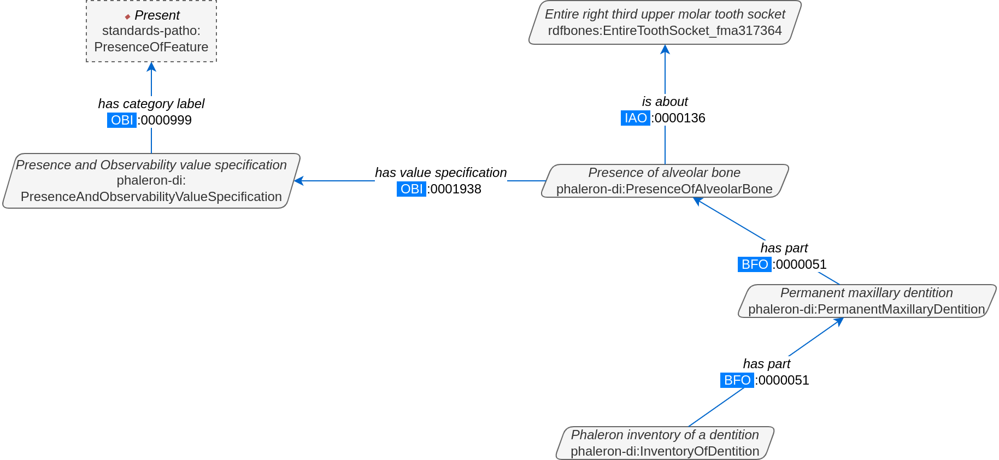

In the above image, we again have an abbreviated version of the network graph of the dental inventory, this time showing the permanent maxilla section with the 'has part' relation from the 'Inventory' tab added in as well. What is important to remember here is that this is the **uninstantiated** version of the data model. The actual dataset produced in AnthroGraph is the **instantiated** version. So now, let us look at how the instantiated version looks like if we translate it to the way we visualise the uninstantiated data model:

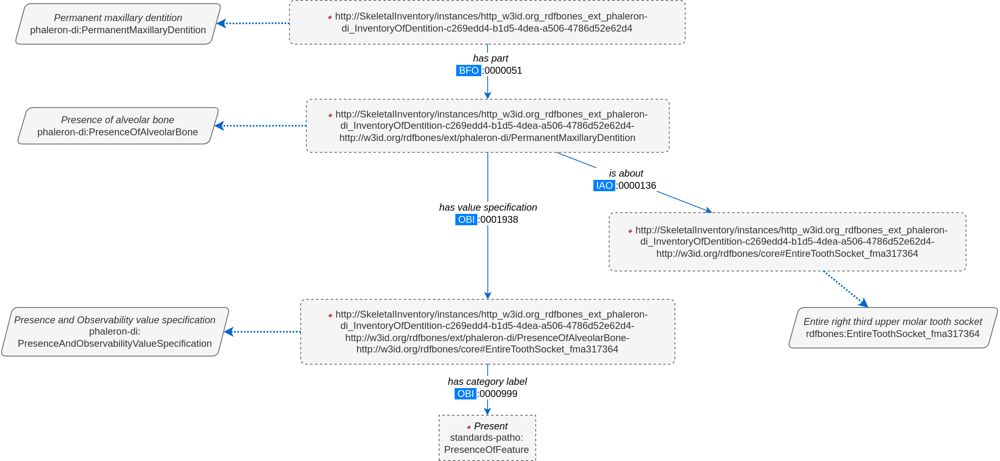

Instantiated means exactly that: all the abstract classes have been replaced by instances. Instances generally do not have labels, and they have a very long IRI. IRI of instances in RDFBones are generally concatenations of  randomly generated numbers and strings that in some way relate to the measurement datum, such as its region of interest; the IRIs are long and random in order to ensure that even if e.g. you have a database with 1,000,000 femurs, each femur instance will still have its own distinct identifier.

Note that each instance has a 'rdf:type' relation to the class it is instantiating (the arrows with dotted lines). This is what translates the model of the network graph to the model of the dataset, this is what the process of instantiating entails. Accordingly, the 'rdf:type' relation is vital when mentally translating the network graph into a SPARQL query.

~~~~~~~~~~~~~~~~~~~~~~~~~~~~~~~~~~~
Using Ontodia to navigate datasets
~~~~~~~~~~~~~~~~~~~~~~~~~~~~~~~~~~~

Ontodia is a visualiser for semantic data built into AnthroGraph. Though awkward to become acquainted with, Ontodia is ultimately a very useful tool for getting to know datasets and for bugfixing when writing SPARQL queries.

Let us re-build the example dataset we made in the previous section using Ontodia. Ontodia can be opened by clicking on the "graph" icon in the top right of the screen when you have opened any kind if inventory. Note that Ontodia always looks for labels, and when a data item does not have a label, it will simply repurpose a truncated version of the IRI of that item as a label. This means that often the lists provided in Ontodia's search function appears to provide redundant or bogus items.

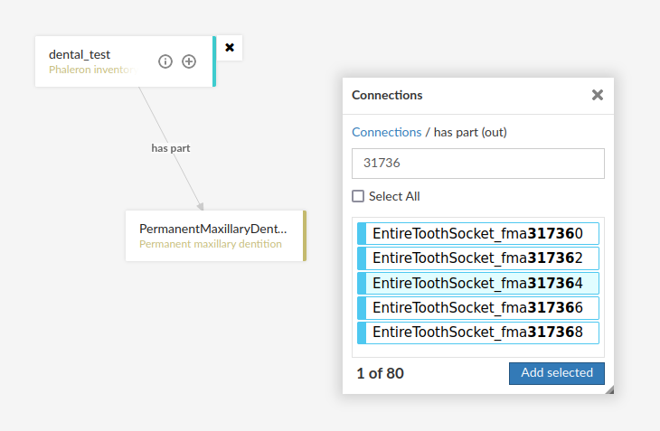

In the case above, we are attempting to open our measurement datum instance of the right third upper molar tooth socket. This socket has arbitrarily received the identification number *317364* in the **Foundational Model of Anatomy** ontology, and so this number has been built into the IRI generated for this instance. Though we lack a true label for our instance, we can use this identifier to nonetheless search for our socket's measurement datum.

*(Note: our documentation currently has a major blind spot here: a select number of regions of interest are borderline unidentifiable for anyone unfamiliar with the ontology files. This is a work in progress. For the moment, please contact us if you bcome stuck on such "hidden" regions of interest)*

We can follow the same path via Ontodia as we would in the network graph by simply clicking on the relevant predicates and selecting the corresponding object, keeping in mind that we are dealing with instances of classes, not the classes themselves.

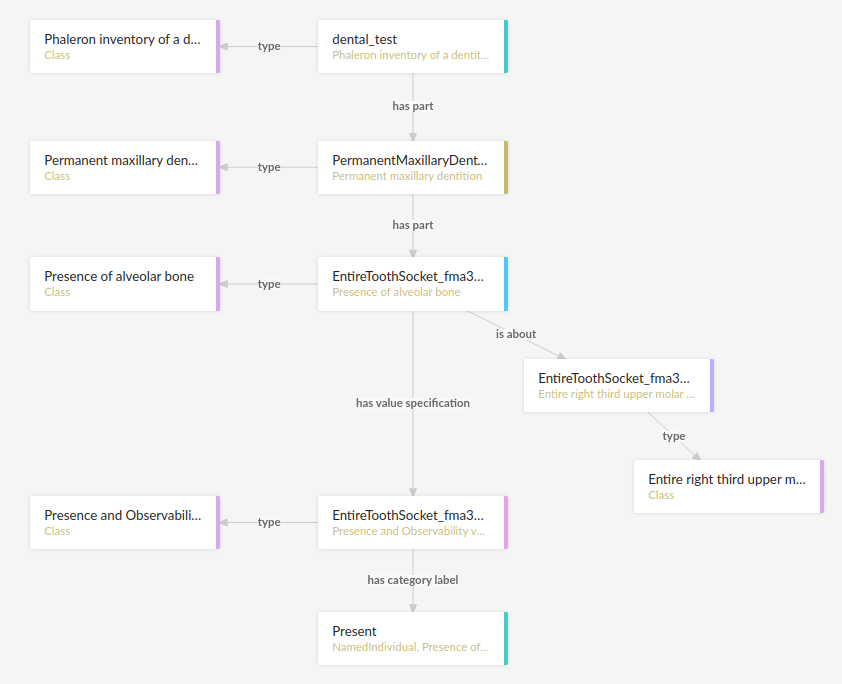

Using Ontodia, we can repoduce the graph seen in the previous section. Herein lies the utility of Ontodia: quickly browse datasets with an intuitive, visualised way. In addition, you can inspect any element by clicking on it, and even copy the full IRI. The extremely long IRIs of the instances you saw in the previous section's image were in fact extracted from Ontodia this way.

---------------------------------------
Introduction to writing SPARQL queries
---------------------------------------

SPARQL queries are written by referencing the data model as it is found in the dataset. In order to know what the data model looks like, it is necessary to either browse the dataset with SPARQL directly, or to look at the corresponding network graph describing the data model. Every RDFBones extension ontology has its own network graph describing the data model of the data produced by extension in question.

.. _PrefixesSection:
++++++++++
Prefixes
++++++++++

Prefixes are defined at the top of a SPARQL query and allow for the use of abbreviations in the query. SPARQL queries do not require prefixes to function, but they are generally recommended, as they greatly reduce visual clutter and simplify the act of writing a query. The abbreviations used in a prefix are arbitrary and are only valid for the query in which they are written, though it is recommended to keep consistency where possible to avoid unnecessary confusion.

Prefixes work in the following way: In a SPARQL query, an IRI must be adressed by being surrounded by the less-than and greater-than sign tags, e.g. 'has part' is employed by writing **<http://purl.obolibrary.org/obo/BFO_0000051>**. By using the prefix **PREFIX obo: <http://purl.obolibrary.org/obo/>**, 'has part' can be written as **obo:BFO_0000051**. Note that some IRIs end with a hash symbol (#) instead of the more typical forward slash.

The following list is non-exhaustive but does contain those prefixes most commonly used in RDFBones-related queries:

* Basic RDF prefixes:

	* PREFIX rdf: <http://www.w3.org/1999/02/22-rdf-syntax-ns#>
	* PREFIX rdfs: <http://www.w3.org/2000/01/rdf-schema#>
	* PREFIX owl: <http://www.w3.org/2002/07/owl#>
	
* Basic RDFBones prefixes:

	* PREFIX core: <http://w3id.org/rdfbones/core#>
	* PREFIX obo: <http://purl.obolibrary.org/obo/>
	* PREFIX vivo: <http://vivoweb.org/ontology/core#>
	* PREFIX cidoc:<http://www.cidoc-crm.org/cidoc-crm/>

* RDFBones extension ontology prefixes:

	* PREFIX standards-si: <http://w3id.org/rdfbones/ext/standards-si/>
	* PREFIX phaleron-si: <http://w3id.org/rdfbones/ext/phaleron-si/>
	* PREFIX phaleron-di: <http://w3id.org/rdfbones/ext/phaleron-di/>
	* PREFIX phaleron-dpatho: <http://w3id.org/rdfbones/ext/phaleron-dpatho/>
	* PREFIX standards-patho: <http://w3id.org/rdfbones/ext/standards-patho/>
	* PREFIX phaleron-patho: <http://w3id.org/rdfbones/ext/phaleron-patho/>
	* PREFIX phaleron-se: <http://w3id.org/rdfbones/ext/phaleron-se/>
	* PREFIX phaleron-ae: <http://w3id.org/rdfbones/ext/phaleron-ae/>

	
++++++++++++++++++++++++++
Querying measurement data
++++++++++++++++++++++++++

Below is a more complex example query that looks for multiple measurement data across multiple inventories. It also uses the OPTIONAL operator. The query inside the OPTIONAL brackets will give a result if there is one, but if there are none, the SELECT values that are queried in the OPTIONAL part simply give a blank result; that is, assuming the rest of the query did find a result!

This query contains comments. Comments are marked by the hash (#) symbol, as is typical in many programming languages. You can copy-paste this query with comments included and SPARQL will simply ingore the comments. ::

	PREFIX rdfs: <http://www.w3.org/2000/01/rdf-schema#>
	PREFIX rdf: <http://www.w3.org/1999/02/22-rdf-syntax-ns#>
	PREFIX obo: <http://purl.obolibrary.org/obo/>
	PREFIX owl: <http://www.w3.org/2002/07/owl#>
	PREFIX core: <http://w3id.org/rdfbones/core#>

	SELECT ?SkeletalInventory ?PresenceM1S ?PresenceM2S ?PresenceM3S ?LeftTibiaCompleteness ?LeftTibiaAnatomicalAspect ?LeftTibiaExtentOfInvolvement ?LeftTibiaAnatomicalSite
	WHERE {

		#Find a dental inventory, identify the human specimen it's about
    	?DentalInventory a <http://w3id.org/rdfbones/ext/phaleron-di/InventoryOfDentition> ;
  			<http://semanticscience.org/resource/SIO_000563> ?HumanIndividualDentition ;
     		obo:BFO_0000051 ?MaxillaryDentition .
    	
    	#Dental inventory has a maxillary dentition part onto which the measurement data are attached
        ?MaxillaryDentition obo:BFO_0000051 ?M1SDatum ;
      		obo:BFO_0000051 ?M2SDatum ;
      		obo:BFO_0000051 ?M3SDatum .
      	
    	#Find the presence measurement datum of socket of upper left molar 1 and show me what its category label is
  		#Since this query only has one M1, we get away without specifying which one it is in the variable.
  		#For the full query, the variable e.g. ?M1SocketUpperLeft would be necessary
    	?M1SDatum rdf:type <http://w3id.org/rdfbones/ext/phaleron-di/PresenceOfAlveolarBone> .
		?M1SDatum obo:IAO_0000136 ?M1SInstance .
		?M1SInstance rdf:type core:EntireToothSocket_fma317376 .
		?M1SDatum obo:OBI_0001938 ?M1SValuespec .
		?M1SValuespec obo:OBI_0000999 ?PresenceM1S .
      
    	#do the same for upper left molar 2
        ?M2SDatum rdf:type <http://w3id.org/rdfbones/ext/phaleron-di/PresenceOfAlveolarBone> .
		?M2SDatum obo:IAO_0000136 ?M2SInstance .
		?M2SInstance rdf:type core:EntireToothSocket_fma317362 .
		?M2SDatum obo:OBI_0001938 ?M2SValuespec .
		?M2SValuespec obo:OBI_0000999 ?PresenceM2S .
    
    	#same for upper left molar 3
        ?M3SDatum rdf:type <http://w3id.org/rdfbones/ext/phaleron-di/PresenceOfAlveolarBone> .
		?M3SDatum obo:IAO_0000136 ?M3SInstance .
		?M3SInstance rdf:type core:EntireToothSocket_fma317380 .
		?M3SDatum obo:OBI_0001938 ?M3SValuespec .
		?M3SValuespec obo:OBI_0000999 ?PresenceM3S .
    	
    	#find a skeletal inventory that is about the same human specimen as the dental inventory is about
     	?SkeletalInventory rdf:type <http://w3id.org/rdfbones/ext/phaleron-si/InventoryForAdultSkeletons> ;
                <http://semanticscience.org/resource/SIO_000563> ?HumanIndividualSkeleton ;
    	 		obo:BFO_0000051 ?LegSection .
    	#though they are about (presumably) the same individual, the dentition and skeletal inventory specimens have their own IRIs
    	#the predicate owl:sameAs tells us that they are nonetheless the same human individual and allows us to query this aspect
    	?HumanIndividualDentition owl:sameAs ?HumanIndividualSkeleton .
    	
    	#analogous to dental inventory, look at the leg section and find the attached measurement data we're looking for
    	?LegSection rdf:type <http://w3id.org/rdfbones/ext/phaleron-si/AdultLeg> ;
                obo:BFO_0000051 ?LeftTibiaCompletenessDatum .
    	?LeftTibiaCompletenessDatum rdf:type <http://w3id.org/rdfbones/ext/standards-si/Representation4States> ;
                obo:OBI_0001938 ?LeftTibiaCompletenessValueSpec ;
                obo:IAO_0000136 ?LeftTibiaInstance .
    	?LeftTibiaInstance rdf:type <http://w3id.org/rdfbones/ext/standards-si/MiddleThirdOfDiaphysisOfLeftTibia> .
    	?LeftTibiaCompletenessValueSpec obo:OBI_0000999 ?LeftTibiaCompleteness .
    
 	#since we also want to see inventories that have a tibia without pathologies, this part of the query needs to be optional
 	#optional sub-queries will simply give blank results if their pattern does not find anything in the database, rather than letting the entire query fail
 	OPTIONAL {
        #find pathologies of tibia; start by moving from the human specimen to the patho-dataset
    	#the specimen of the skeletal inventory is used as the input (obi:0000293) to produce the output (obi:0000299) patho dataset
    	?PathologyInvestigation obo:OBI_0000293 ?HumanIndividualSkeleton ;
                   obo:OBI_0000299 ?PathoDataset .
    	?PathoDataset rdf:type <http://w3id.org/rdfbones/ext/phaleron-patho/PhaleronPaleopathologyDataset> ;
                   obo:BFO_0000051 ?BoneAddition .
    	?BoneAddition rdf:type <http://w3id.org/rdfbones/ext/phaleron-patho/BoneAdditionDatasetSection> ;
                   obo:BFO_0000051 ?LeftTibiaROISpec .
    	#The ROI-Specification instance is an anchor point for the data items of a patho-observation
    	?LeftTibiaROISpec rdf:type <http://w3id.org/rdfbones/ext/phaleron-patho/PhaleronROISpecification> ;
                    #Since this is the same tibia instance as the one in the query of the skeletal inventory, I can adress the same variable here
        			obo:IAO_0000136 ?LeftTibiaInstance ;
                    obo:BFO_0000051 ?LeftTibiaAspect ;
        			obo:BFO_0000051 ?LeftTibiaExtent ;
    				obo:BFO_0000051 ?LeftTibiaSite .
        
    	?LeftTibiaAspect obo:OBI_0001938 ?LeftTibiaAspectValueSpec .
    	?LeftTibiaAspectValueSpec a <http://w3id.org/rdfbones/ext/phaleron-patho/AnatomicalAspectValueSpecification> ;
        			obo:OBI_0000999 ?LeftTibiaAnatomicalAspect .
    	?LeftTibiaExtent obo:OBI_0001938 ?LeftTibiaExtentValueSpec .
    	?LeftTibiaExtentValueSpec a <http://w3id.org/rdfbones/ext/phaleron-patho/ExtentOfInvolvementValueSpecification> ;
        			obo:OBI_0000999 ?LeftTibiaExtentOfInvolvement .
    	?LeftTibiaSite obo:OBI_0001938 ?LeftTibiaSiteValueSpec .
        ?LeftTibiaSiteValueSpec a <http://w3id.org/rdfbones/ext/phaleron-patho/AnatomicalSiteValueSpecification> ;
        			obo:OBI_0000999 ?LeftTibiaAnatomicalSite .
 		}
	}
	
Note that the results of this query are quite nonsensical. The point here is to show how we can query mutliple measurement data at once and how to connect a skeletal inventory dataset to a dental and/or pathological dataset.

+++++++++++++++++
SPARQL resources
+++++++++++++++++

The World Wide Web Consortium has an excellent to-the-point manual with examples for every aspect of SPARQL: https://www.w3.org/TR/sparql11-query/

This manual is especially useful for learning how to correctly format expressions and operators like FILTER NOT EXISTS, VALUES, writing subqueries, etc.