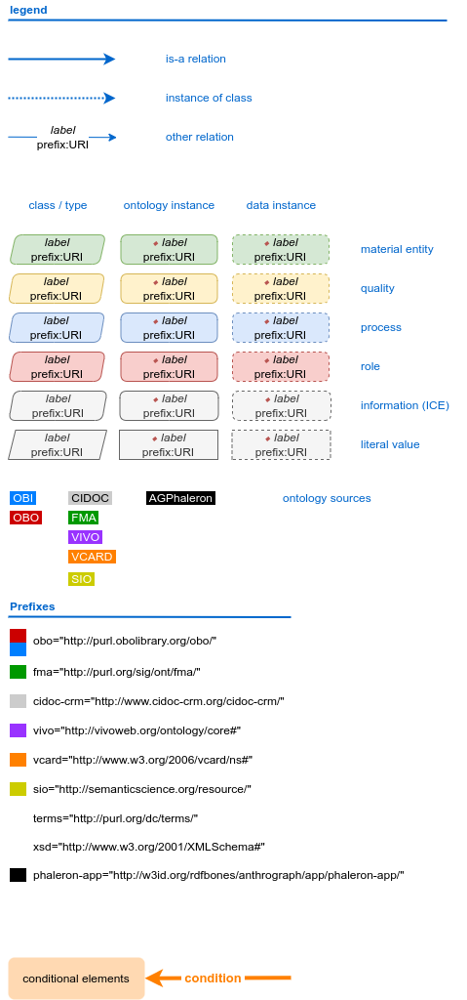

.. _legend:

Legend for Network Graphics
===========================

This is the legend for all network graphics in the RDFBones documentation.

   
The design follows the network graphics in the `documentation <http://obi-ontology.org/docs/core-classes/>`_ of the :ref:`obi`.

The colour coding of the prefixes designates the ontology from which a term is imported, not where it was initially defined. As a consequence, the prefixes of all classes in the OBI are marked in blue, even if elements originate from the Basic Formal Ontology (BFO), the Information Artifact Ontology (IAO) or other OBO ontologies. Elements that are imported from other OBO ontologies are marked in red.

To save space, the prefix of OBO elements carries the shorthand of the ontology where they were originally defined. It is followed by the ID from that ontology. The following examples illustrate how prefix notations are converted into complete IRIs.

=============== ==============================================
Prefix notation Complete IRI
=============== ==============================================
OBI:0000066     http://purl.obolibrary.org/obo/OBI_0000066     
FOODON:03301364 http://purl.obolibrary.org/obo/FOODON_03301364
=============== ==============================================
