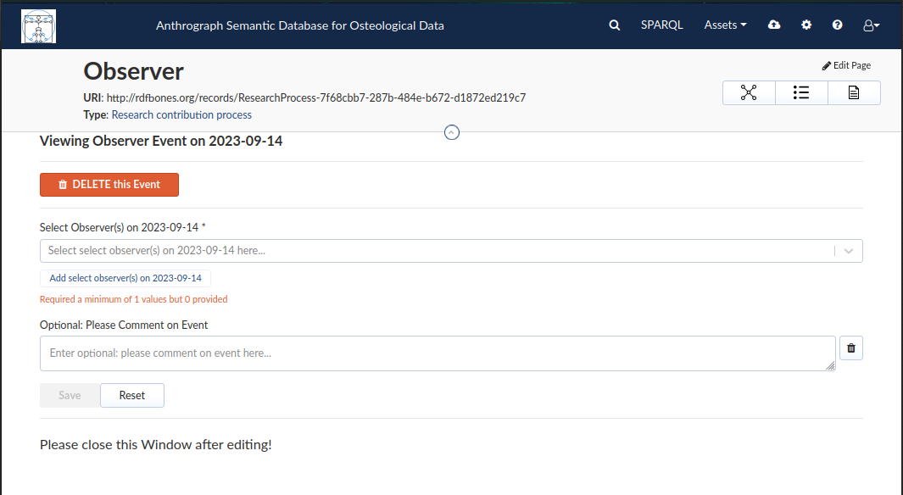

******************
AnthroGraph Guide
******************
This guide provides information on the modules that the AnthroGraph system includes and gives basic information on how they work.

===========================
Skeletal Inventory modules
===========================

The skeletal inventory records basic data on the skeletal individual, such as presence or absence of bones and their taphonomic alterations. Inventories can be created by clicking on the "Skeletal Inventories" link in the sidebar, entering a unique label, and selecting the according inventory type. Inventory types include adult skeletons, juvenile skeletons, and dental inventories. Creating a new inventory automatically redirects the user to the inventory's data entry page.

   
Once an inventory has been created, it appears in the list above the "Create new inventory" section. Clicking on the inventory name opens the inventory.

------------------------------
Inventory for adult skeletons
------------------------------

Inventories for adult skeletons stand in contrast to inventories for juvenile skeletons. When opening an inventory for adult skeletons, the page opens at the "General information" tab. Above the tabs are 3 important fields:

.. image:: gfx/anthrograph/SkelInventoryGen.png
   :scale: 75 %
   
The Skeletal Inventory ID, also known as the label of the inventory, can be changed by entering a new label in the field and clicking "Change Skeletal Inventory ID".
The "DELETE Entire Skeletal Inventory" button will delete the inventory that is currently open.
The "Download CSV Table" button will generate a CSV file containing all the data that has been entered in the inventory.

The general information tab allows the user to enter a comment on the inventory. Further down is the "Create New Observer/Editing Event" section.

   
This allows the user to enter either an "observer" or a "data editor". In either case, a date must be selected as well. The created observer or data editor event will then appear in the list directly below.

.. image:: gfx/anthrograph/CreatedEvent.png
   :scale: 75 %

Clicking on the event will open a new page in a new tab where information on the event can be entered.

   
Once the data has been entered, this page can be closed. To enter data on the status of the bones, the user must switch to the according tab. In the following image, the cranial tab has been opened:

.. image:: gfx/anthrograph/SkelInventoryCranium.png
   :scale: 75 %
   
This shows some of the items that can entered in the adult skeletal inventory: "Completeness", "Observability", and "Unsided Fragments". One of the "Completeness" fields has been selected in order to show the drop-down menu that opens. In order to save the entered information, the user must have entered data into all mandatory fields. To ensure the user need not enter an entire skeleton in one go, save buttons are bound to sizable units of skeletal regions, such as the frontal bone in the above image.

-------------------------
Inventory of a dentition
-------------------------

Dental inventories are created same as inventories for adult skeletons, save that the "inventory of dentition" must be selected as the inventory type.

   
After creation, dental inventories appear in the inventory list along with all other inventories. The inventory can be opened by clicking on the label.

.. image:: gfx/anthrograph/DentalInvDataset.png
   :scale: 75 %
   
The three options at the top of the inventory page mirrors those of the adult skeletal inventory:

The Skeletal Inventory ID, also known as the label of the inventory, can be changed by entering a new label in the field and clicking "Change Skeletal Inventory ID".
The "DELETE Entire Skeletal Inventory" button will delete the inventory that is currently open.
The "Download CSV Table" button will generate a CSV file containing all the data that has been entered in the inventory.

The general tab allows the user to associate an adult or juvenile skeletal inventory with the dental inventory that is currently opened. The data entry works similar to the adult skeletal inventory in that most fields must have information entered in order for the save button to become enabled. Most fields also produce a drop-down menu with all possible options when clicked.

===================
Estimation modules
===================

As their name suggests, the age estimation module records information required to estimate the age of a skeleton, while the sex estimation module records the information necessary to estimate the sex of an individual. Both modules require an existing adult or juvenile skeletal inventory to be associated with; the age estimation module further requires a sex to be decided before an age estimation dataset can be created for a skeleton, though the associated sex estimation dataset does not have be created beforehand as well.

---------------
Age Estimation
---------------

Age estimations can be performed by clicking the "Age Estimation" link in the sidebar.

.. image:: gfx/anthrograph/AgeEstList.png
   :scale: 75 %

Age estimations require an adult or juvenile skeletal inventory; at least 3 characters must be entered, which then highlights all inventories that contain those characters in their label and that are eligible as a basis for age estimations.

   
The estimated sex must be entered first before the age estimation can be created. Once an associated skeletal inventory and sex are selected, the age estimation can be created by clicking "Save".

.. image:: gfx/anthrograph/AgeEstDataset.png
   :scale: 75 %

The label of the age estimation is generated automatically. The selected sex is visible at the top (in the screenshot above: "Selected Biological Sex Role: Male specimen role"). As usual, the button for deleting the age estimation dataset is located at the top in the form of a red button.

Values for the pubic symphysis can only be entered if the respective item is marked as "observable" in the skeletal inventory.

---------------
Sex Estimation
---------------

Sex estimations can be performed by clicking the "Sex Estimation" link in the sidebar.

.. image:: gfx/anthrograph/SexEstList.png
   :scale: 75 %

As with age estimations, sex estimations require an adult or juvenile skeletal inventory; at least 3 characters must be entered, which then highlights all inventories that contain those characters in their label and that are eligible as a basis for sex estimations.

 .. image:: gfx/anthrograph/SexEstDataset.png
   :scale: 75 %
   
The label of the sex estimation is generated automatically. As usual, the button for deleting the sex estimation dataset is located at the top in the form of a red button, where you can also find the button for cownloading the dataset as a CSV file analogous to the option in the adult and juvenile skeletal inventories.

 .. image:: gfx/anthrograph/SexEstValuePattern.png
   :scale: 75 %

With the exception of the comment and observer/data editor fields, all fields in the sex estimation are entered via drop-down menu. Unlike the age estimation module, the sex estimation module does not check whether or not the skeletal element being rated is marked as "observable" in the associated skeletal inventory.

=======================
Paleopathology modules
=======================

The paleopathology modules, also called "paleopath" or just "patho" modules, are split into dental and non-dental datasets, just as the skeletal inventories are. To create a paleopath module, click on the "Paleopath Module" link in the sidebar. You can then choose between the non-dental skeletal inventory "PBP Osteo Paleopath" and the dental inventory "PBP Dental Paleopath".

 .. image:: gfx/anthrograph/PathoList.png
   :scale: 75 %

As with the age- and sex estimations, the inventories to be associated with the paleopath module dataset must be selected by entering at least 3 characters in the according field, which then highlights all inventories that contain those characters in their label and that are eligible as a basis for the respective type of paleopathology dataset. Since dental and non-dental paleopath datasets are seperated into 2 distinct modules, they do not appear in the same list.

---------------------
PBP Dental Paleopath
---------------------

 .. image:: gfx/anthrograph/PathoDentalDummy.png
   :scale: 75 %

Dental paleopath datasets can be filled out similar to inventories. In the image above, a dental paleopath dataset has been filled out with dummy data, and the drop-down menu of a field is opened to show the options for that field. As with non-dental paleopath datasets, when attempting to enter a pathological observation, the respective element must be marked as observable in the associated inventory; if it is not, the drop-down menu may restrict the number of options possible.

--------------------
PBP Osteo Paleopath
--------------------

The osteo paleopath module differs slightly from the other modules in that the dataset allows for many combinations of options, which requires a more complex entry form.

 .. image:: gfx/anthrograph/PathoOsteoDataset.png
   :scale: 75 %
   
First, the region in which the pathology is found must be selected. The user must switch to the tab of the region in which the pathology is found. Then, the user may select the type of pathology, e.g. bone addition or trauma, and then enter a label for the pathology.

 .. image:: gfx/anthrograph/PathoROIEntry.png
   :scale: 75 %

In the image above, a pathology "skull" tab was created under the "bone addition" field with the label "temporal_bone_addition". Once saved, a new page opens, where the region can be further defined for the pathology under the "New ROI Specification" field. Only elements related to the overarching region (in this case the skull/cranium) are available, and only those that are marked as "observable". Multiple regions can be saved, and they will appear in the list below.

 .. image:: gfx/anthrograph/PathoROIAdvanced.png
   :scale: 75 %

When a region has been selected, a new page will open where this region can likewise be further defined. 

 .. image:: gfx/anthrograph/PathoROIAdvPattern.png
   :scale: 75 %

As seen in the image above, a drop-down menu opens in the fields for these details. Once all data has been entered on this page, the user can use the "-> Back to [label] Section Summary" to choose a further region or fill in the "Additional Information" below.

 .. image:: gfx/anthrograph/PathoROIEntrySpecs.png
   :scale: 75 %